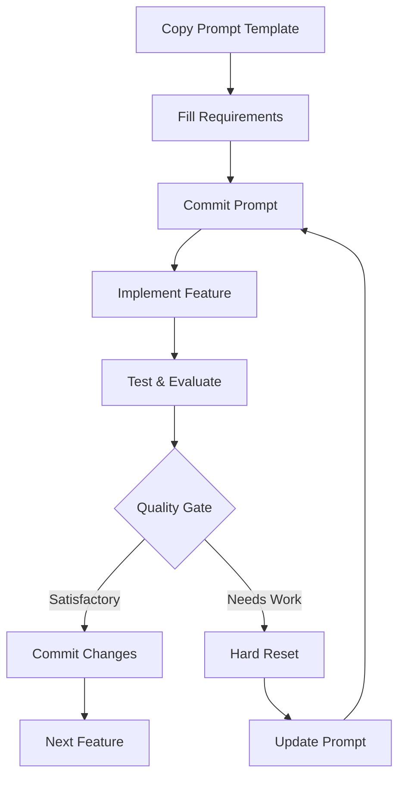

# The Dao of Hard Reset

> A pragmatic approach to iterative software development that embraces the power of "reset and retry" for better outcomes.

## What is Vibe Coding?

Vibe coding is a development methodology that combines structured iteration with the flexibility to reset and improve when needed. It acknowledges that the first attempt isn't always the best and provides a framework for continuous improvement through deliberate iteration cycles.

## Core Principles

- **Reset with Purpose**: When stuck or unsatisfied, reset to a clean state and try again with new insights
- **Iterate with Intention**: Each iteration should build on learnings from previous attempts
- **Ship with Confidence**: Only commit when the implementation meets your quality standards

## Quick Start

1. **Set up your project structure**:
   ```
   your-project/
   ├── development/           # Store iteration prompts here
   ├── playground/           # Isolated experimentation
   └── [your source code]
   ```

2. **Copy the prompt template**:
   ```bash
   cp resources/prompt-template.md development/1-your-feature.md
   ```

3. **Fill in the template** with your feature requirements

4. **Follow the iteration cycle**:
   - Commit your prompt
   - Implement the feature
   - Test and evaluate
   - If unsatisfied: reset, refine prompt, repeat
   - If satisfied: commit and move on

## Repository Contents

### 📋 [approach.md](approach.md)
The complete methodology guide covering:
- Prerequisites and setup
- 4-phase workflow (Planning → Implementation → Quality Gate → Decision)
- Playground development strategy
- Success metrics

### 🛠️ [resources/prompt-template.md](resources/prompt-template.md)
Comprehensive template for creating feature development prompts with sections for:
- Project context and requirements
- Technical specifications
- Quality criteria and acceptance tests
- Implementation guidance

### 📖 [resources/template-usage-guide.md](resources/template-usage-guide.md)
Practical guide for using the prompt template effectively:
- Quick start instructions
- Tips for better prompts
- Common iteration patterns
- Troubleshooting advice

## The Workflow



## When to Use This Approach

**✅ Great for:**
- Solo development projects
- Rapid prototyping
- Learning new technologies
- Complex features with unclear requirements
- AI-assisted development

**⚠️ Consider alternatives for:**
- Large team collaborations
- Critical production hotfixes
- Simple, well-defined tasks
- Strict regulatory environments

## Philosophy

The Dao of Hard Reset recognizes that software development is inherently iterative and that perfection often comes through refinement rather than getting it right the first time. By embracing controlled failure and systematic improvement, developers can achieve higher quality outcomes while maintaining development velocity.

## Getting Started

1. Read the [approach guide](approach.md) to understand the methodology
2. Review the [prompt template](resources/prompt-template.md) structure
3. Check the [usage guide](resources/template-usage-guide.md) for practical tips
4. Start with a simple feature to practice the workflow

## Contributing

This methodology is a living document. Feel free to:
- Adapt the templates for your specific needs
- Share improvements and variations
- Document lessons learned from your iterations

## License

This project is open source. Use, modify, and share freely.

---

*"Reset with purpose, iterate with intention, ship with confidence."*